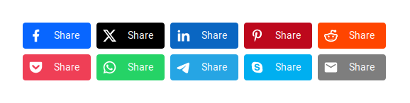

<div align="center">


# Nuxt Social Share

[![npm version][npm-version-src]][npm-version-href]
[![npm downloads][npm-downloads-src]][npm-downloads-href]
[![code quality][code-quality-src]][code-quality-href]
[![License][license-src]][license-href]
[![Nuxt][nuxt-src]][nuxt-href]
<!-- [![bundle size][bundle-size-src]][bundle-size-href] -->



Simple Social Sharing for Nuxt

[Release Notes](/CHANGELOG.md)

</div>

> [!IMPORTANT]
> This is an early release, changes on its code and on the API are possible until a stable release will be published.
> Anyway, considering its very simple functionality, it can be already assumed to be safe to use.
> Feedback, suggestions and contributions by the community are welcome.


## 🌟 Features

- Provides a minimal config `<SocialShare>` component
- The component is unstyled by default for easy integration in any design
- Optional styled version, that can still be further customized
- A `useSocialShare` composable is exposed, to provide even more flexibility if needed
- Many major social networks supported

## 🛠️ Quick Setup

1. Add `@stefanobartoletti/nuxt-social-share` dependency to your project

```bash
# pnpm
pnpm add -D @stefanobartoletti/nuxt-social-share
# yarn
yarn add --dev @stefanobartoletti/nuxt-social-share
# npm
npm install --save-dev @stefanobartoletti/nuxt-social-share
```

2. Add `@stefanobartoletti/nuxt-social-share` to the `modules` section of `nuxt.config.ts`

```js
export default defineNuxtConfig({
  modules: [
    '@stefanobartoletti/nuxt-social-share'
  ],
  // optional configuration
  socialShare: {
    // module options
  }
})
```

That's it! You can now use Nuxt Social Share in your Nuxt app ✨

## 🎨 Using the `<SocialShare>` component

The `<SocialShare>` component provides a share button for a single social network, that you must select with the `network` prop; you will need to use it as many times as your total needed networks.

```vue
<!-- Basic use -->
<SocialShare network="facebook" />

<SocialShare network="twitter" />

<SocialShare network="linkedin" />

<!-- Customization with props -->
<SocialShare network="facebook" :styled="true" :label="false" />
```

The component will render by default the following minimal HTML: 

```html
<a 
  class="social-share-button social-share-button--{network}"
  href="{share url}"
  style="--color-brand: {network brand color};"
  aria-label="Share with {network}"
  target="_blank"
>
  <svg class="social-share-button__icon">{...}</svg>
  <span class="social-share-button__label">Share</span>
</a>
```

An additional `social-share-button--styled` class will be added to the `<a>` element if `:styled="true"`, while the `<span>` element will not be rendered if `:label="false"`.

> [!NOTE]
> - The component comes unstyled by default, only providing some minimal flex properties to correctly align icon and label.
> - Every button has a `social-share-button--{network}` class and a *local* `--color-brand` CSS variable based on the selected social network; you can use them to customize your styles.
> - It is also possible to use Tailwind to style the component. Applied classes that will be passed down to the `<a>` element.
> - These customizations are also possible when using the `styled` version.
> - The only required prop is `network`, other like `styled` or `label` are best set from the module options (see 'Configuration' below)
> - The component only provides a single share button. As you will typically need to use more of them at once, you should place them inside a wrapper to distribute them according to your design.
> - In order to avoid duplicate code when using many instances of the component, especially if you need to customize it, a wise approach is to iterate it with `v-for` and an array of the needed networks.

A common use when using i.e. Tailwind could be as follows:

```vue
<div class="flex flex-row gap-2">
  <SocialShare
    v-for="network in ['facebook', 'twitter', 'linkedin', 'email']"
    :key="network"
    :network="network"
    :styled="true"
    :label="false"
    class="p-4 rounded-none"
  />
</div>
```

### Props

| Name | Required | Type | Default | Notes |
| ---- | -------- | ---- | ------- | ----- |
| `network` | `Yes` | `String` | none | The social network or messaging service where the content should be shared. This is required for the component to work. A list of the supported networks is available below. |
| `styled` | `No` | `Boolean` | `false` | Whether the component should be styled or not. It is `false` by default to allow for easier custom styling. Additional customization is possible also when set to `true` (*).  |
| `label` | `No` | `Boolean` | `true` | Whether the text label should be rendered or not. It is `true` by default, when set to `false` only the icon will be displayed (*).  |
| `url` | `No` | `String` | the current page URL | The URL that will be shared on the selected social network. Defaults to the current page address. On most cases you don't need another value, but if you need a different value, you can set it with this prop. |


> [!TIP]
> (*) It is also possible to globally set this property from the module options. It is available also as a prop to allow a different behavior on a single instance of the component.


## 🔩 Using the `useSocialShare` composable

Using the customizable component should cover almost every use case, but if needed the `useSocialShare` composable can be directly accessed for even more flexibility. This composable is used internally to create the `<SocialShare>` components.

Like the component, one instance of `useSocialShare` should be used for every needed share.

An options object should be passed as an argument, like in the following example:

```vue
<script setup>
// Basic minimal use
const shareFacebook = useSocialShare({ network: 'facebook' })

// All possible options
const shareFacebook = useSocialShare({
  network: 'facebook', // Required
  url: 'https://www.example.com' // Optional, defaults to current page URL if not provided
})
</script>
```

It will return the following object:

```json
{
  "name": "facebook", // Name of the selected social network
  "shareUrl": "https://www.facebook.com/sharer/sharer.php?u=https://www.example.com", // Sharing url
  "iconName": "ri:facebook-fill", // Icon name from "@iconify/vue" package
  "color": "#0866FF" // Main brand color of the selected network
}
```

You can then use some or all the returned properties, according to your project setup and requirements.


## 🎛️ Configuration

Module options can be set from the `socialShare` key in `nuxt.config.ts`:

```ts
export default defineNuxtConfig({
  // optional configuration
  socialShare: {
    // module options
  }
})
```

Available options:

| Name | Type | Default | Notes |
| ---- | ---- | ------- | ----- |
| `styled` | `Boolean` | `false` | Whether the `<SocialShare>` components should be styled or not. It is `false` by default to allow for easier custom styling (*).                                      |
| `label`  | `Boolean` | `true`  | Whether the text label in the `<SocialShare>` components should be rendered or not. It is `true` by default, when set to `false` only the icon will be displayed (*). |


> [!TIP]
> (*) It can be set also on a single component level via props, but it is usually better to set this from the module options to create your defaults, and override it with props only if needed.

## ↗️ Supported networks

A list of the currently supported networks and of their URL arguments.

| Social Network | `url` | Notes |
| -------------- | ----- | ----- |
| `facebook`     | ✔️     |       |
| `twitter`      | ✔️     |       |
| `linkedin`     | ✔️     |       |
| `pinterest`    | ✔️     |       |
| `reddit`       | ✔️     |       |
| `pocket`       | ✔️     |       |
| `whatsapp`     | ✔️     |       |
| `telegram`     | ✔️     |       |
| `skype`        | ✔️     |       |
| `email`        | ✔️     |       |

> [!NOTE]
> Currently I have only included networks that I use and that I have personally tested to be working. More are planned to be added, contributions are welcome.

> [!IMPORTANT]
> At the moment only the `url` argument is implemented. More, like `title`, `text` and other, are planned for a future release. 
> Anyway, please note that only `url` is strictly required for the sharing to work. When not explicity set, other metadata will be retrived by most social networks from Open Graph meta tags, that you always should properly set in your webpages anyway.

## 🤝 Contributing

> [!NOTE]
> If you want to contribute you can start by reading the [Contributing guidelines](https://github.com/stefanobartoletti/nuxt-social-share/blob/master/.github/CONTRIBUTING.md).
>

- Clone this repository
- Enable [Corepack](https://github.com/nodejs/corepack) using `corepack enable`
- Install dependencies using `pnpm install`
- Run `pnpm dev:prepare` to generate type stubs.
- Use `pnpm dev` to start [playground](./playground) in development mode.

## 📝 License

[MIT](https://github.com/stefanobartoletti/nuxt-social-share/blob/main/LICENSE)

© 2023-present [Stefano Bartoletti](https://www.stefanobartoletti.it)

<!-- Badges -->
[npm-version-src]: https://img.shields.io/npm/v/@stefanobartoletti/nuxt-social-share/latest.svg?style=flat&colorA=18181B&colorB=28CF8D
[npm-version-href]: https://npmjs.com/package/@stefanobartoletti/nuxt-social-share

[npm-downloads-src]: https://img.shields.io/npm/dm/@stefanobartoletti/nuxt-social-share.svg?style=flat&colorA=18181B&colorB=28CF8D
[npm-downloads-href]: https://npmjs.com/package/@stefanobartoletti/nuxt-social-share

[code-quality-src]: https://img.shields.io/codacy/grade/437177566f784faf81dc6382e0919017.svg?style=flat&colorA=18181B&colorB=28CF8D
[code-quality-href]: https://app.codacy.com/gh/stefanobartoletti/nuxt-social-share

[bundle-size-src]: https://img.shields.io/bundlephobia/minzip/@stefanobartoletti/nuxt-social-share.svg?style=flat&colorA=18181B&colorB=28CF8D
[bundle-size-href]: https://bundlephobia.com/result?p=@stefanobartoletti/nuxt-social-share

[license-src]: https://img.shields.io/npm/l/@stefanobartoletti/nuxt-social-share.svg?style=flat&colorA=18181B&colorB=28CF8D
[license-href]: https://npmjs.com/package/@stefanobartoletti/nuxt-social-share

[nuxt-src]: https://img.shields.io/badge/Nuxt-18181B?logo=nuxt.js
[nuxt-href]: https://nuxt.com
