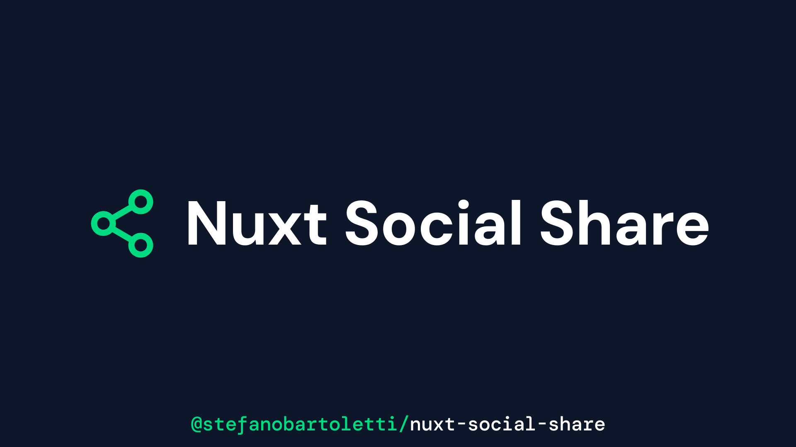

<picture></picture>

<div align="center">

[![npm version][npm-version-src]][npm-version-href]
[![npm downloads][npm-downloads-src]][npm-downloads-href]
[![code quality][code-quality-src]][code-quality-href]
[![License][license-src]][license-href]
[![Nuxt][nuxt-src]][nuxt-href]
<!-- [![bundle size][bundle-size-src]][bundle-size-href] -->

<picture></picture>

Simple Social Sharing for Nuxt 3

[Release Notes](/CHANGELOG.md) |
[Demo](https://stefanobartoletti.github.io/nuxt-social-share/)

</div>

## 🌟 Features

- Provides a minimal config `<SocialShare>` component
- The component is unstyled by default for easy integration in any design
- Optional styled version, that can still be further customized
- A `useSocialShare` composable is exposed, to provide even more flexibility if needed
- Many major social networks supported

## 🛠️ Quick Setup

1. Add `@stefanobartoletti/nuxt-social-share` dependency to your project

```bash
npx nuxi@latest module add nuxt-social-share
```

2. Nuxi should have already added `@stefanobartoletti/nuxt-social-share` to the `modules` section of `nuxt.config.ts`, if not add it manually:

```js
export default defineNuxtConfig({
  // module added by Nuxi
  modules: [
    '@stefanobartoletti/nuxt-social-share'
  ],
  // optional configuration, should be added manually
  socialShare: {
    // module options
  }
})
```

That's it! You can now use Nuxt Social Share in your Nuxt app ✨

## 🎨 Using the `<SocialShare>` component

The `<SocialShare>` component provides a share button for a single social network, that you must select with the `network` prop; you will need to use it as many times as your total needed networks.

```vue
<!-- Basic use -->
<SocialShare network="facebook" />

<SocialShare network="twitter" />

<SocialShare network="linkedin" />

<!-- Customization with props -->
<SocialShare network="facebook" :styled="true" :label="false" />
```

The component will render by default the following minimal HTML:

```html
<a
  class="social-share-button social-share-button--{network}"
  href="{share url}"
  style="--color-brand: {network brand color};"
  aria-label="Share with {network}"
  target="_blank"
>
  <svg class="social-share-button__icon">{...}</svg>
  <span class="social-share-button__label">Share</span>
</a>
```

An additional `social-share-button--styled` class will be added to the `<a>` element if `:styled="true"`, while the `<span>` and `<svg>` elements will be rendered conditionally according to the `label` and `icon` props.

> [!NOTE]
> - The component comes unstyled by default, only providing some minimal flex properties to correctly align icon and label.
> - Every button has a `social-share-button--{network}` class and a *local* `--color-brand` CSS variable based on the selected social network; you can use them to customize your styles.
> - It is also possible to use Tailwind to style the component. Applied classes that will be passed down to the `<a>` element.
> - These customizations are also possible when using the `styled` version.
> - The only required prop is `network`, other like `styled` or `label` are best set from the module options (see 'Configuration' below)
> - The component only provides a single share button. As you will typically need to use more of them at once, you should place them inside a wrapper to distribute them according to your design.
> - In order to avoid duplicate code when using many instances of the component, especially if you need to customize it, a wise approach is to iterate it with `v-for` and an array of the needed networks.

A common use when using i.e. Tailwind could be as follows:

```vue
<div class="flex flex-row gap-2">
  <SocialShare
    v-for="network in ['facebook', 'twitter', 'linkedin', 'email']"
    :key="network"
    :network="network"
    :styled="true"
    :label="false"
    class="p-4 rounded-none"
  />
</div>
```

### Props

| Name | Required | Type | Default | Notes |
| ---- | -------- | ---- | ------- | ----- |
| `network` | `Yes` | `String` | none | The social network or messaging service where the content should be shared. This is required for the component to work. A list of the supported networks is available below. |
| `styled` | `No` | `Boolean` | `false` | Whether the component should be styled or not. It is `false` by default to allow for easier custom styling. Additional customization is possible also when set to `true` (*).  |
| `label` | `No` | `Boolean` | `true` | Whether the text label should be rendered or not (*).  |
| `icon` | `No` | `Boolean` | `true` | Whether the icon should be rendered or not (*).  |
| `url` | `No` | `String` | the current page URL | The URL that will be shared on the selected social network. Defaults to the current page address. On most cases you don't need another value, but if you need to change it, you can set it with this prop. |
| `title` | `No` | `String` | none | Title used as a parameter of the sharing URL in supported networks. Optional, see the "Supported Networks" table below |
| `user` | `No` | `String` | none | Username used as parameter of the sharing URL in supported networks. Optional, see the "Supported Networks" table below |
| `hashtags` | `No` | `String` | none | Hashtags used as parameter of the sharing URL in supported networks. Optional, see the "Supported Networks" table below |
| `image` | `No` | `String` | none | Image path used as parameter of the sharing URL in supported networks. Optional, see the "Supported Networks" table below |

> [!TIP]
> (*) It is also possible to globally set this property from the module options. It is available also as a prop to allow a different behavior on a single instance of the component.

### Slots

The `<SocialShare>` component comes with two named slots, that can be used respectively to customize the label or the icon. These slots can be used alone or together.

> [!NOTE]
> These slots are still affected by respective `label` and `icon` settings, either being provided by the module options or by the component props. If set to `false`, no label or icon will be rendered, even if a custom value is provided in the respective slots.

#### `label`

Used to customize the button's label. Optional, defaults to *"Share"* if not provided.

Example:

```vue
<!-- Custom label, renders the network name -->
<SocialShare
  v-for="network in ['facebook', 'twitter', 'linkedin', 'email']"
  :key="network"
  :network="network"
>
  <template #label>{{ network }}</template>
</SocialShare>
```

#### `icon`

Used to customize the button's icon. Useful when another icon style is required. Optional, defaults to the internal style icons if not provided. Both a raw `svg` or a custom component can be used.

Works nicely with the [NuxtIcon](https://github.com/nuxt-modules/icon) module, if used.

```vue
<!-- Custom icon -->
<SocialShare
  v-for="network in ['facebook', 'twitter', 'linkedin', 'email']"
  :key="network"
  :network="network"
>
  <!-- Either with a custom SVG ... -->
  <template #icon><svg>{...}</svg></template>
  <!-- ... OR with a component, i.e. from NuxtIcon -->
  <template #icon><Icon name="mdi:${network}" /></template>
</SocialShare>
```

### Localization

The `<SocialShare>` comes with two strings localized by default in English: the rendered label inside the button, and the value of the `aria-label` attribute used for accessibility purposes.

It is very easy to customize and localize both these strings, by using both the `label` slot and providing an `aria-label` attribute that will override the default value:

```vue
<SocialShare
  v-for="network in ['facebook', 'twitter', 'linkedin', 'email']"
  :key="network"
  :network="network"
  :aria-label="`Condividi con ${network}`"
>
  <template #label>Condividi</template>
</SocialShare>
```

## 🔩 Using the `useSocialShare` composable

Using the customizable component should cover almost every use case, but if needed the `useSocialShare` composable can be directly accessed for even more flexibility. This composable is also used internally to create the `<SocialShare>` components.

Like the component, one instance of `useSocialShare` should be used for every needed share.

An options object should be passed as an argument, like in the following example:

```vue
<script setup>
// Basic minimal use
const shareFacebook = useSocialShare({ network: 'facebook' })

// All possible options
const shareFacebook = useSocialShare({
  network: 'facebook', // Required!
  url: 'https://www.example.com', // Optional, defaults to current page URL if not provided
  title: 'My Custom Title', // Optional, see the "Supported Networks" table below
  user: 'twitter_user', // Optional, see the "Supported Networks" table below
  hashtags: 'list,of,hashtags', // Optional, see the "Supported Networks" table below
  image: 'https://www.example.com/path/to/image.jpg', // Optional, see the "Supported Networks" table below
})
</script>
```

It will return the following object:

```jsonc
{
  "name": "facebook", // Name of the selected social network
  "shareUrl": "https://www.facebook.com/sharer/sharer.php?u=https://www.example.com", // Sharing url
  "icon": {
    "viewBox": "0 0 24 24",
    "path": "M14 13.5h2.5l1-4H14v-2c0-1.03 0-2 2-2h1.5V2.14c-.326-.043-1.557-.14-2.857-.14C11.928 2 10 3.657 10 6.7v2.8H7v4h3V22h4z"
  }, // SVG Icon attributes
  "color": "#0866FF" // Main brand color of the selected network
}
```

You can then use some or all the returned properties, according to your project setup and requirements.

## 🎛️ Configuration

Module options can be set from the `socialShare` key in `nuxt.config.ts`:

```ts
export default defineNuxtConfig({
  // optional configuration
  socialShare: {
    // module options
  }
})
```

Available options:

| Name | Type | Default | Notes |
| ---- | ---- | ------- | ----- |
| `styled` | `Boolean` | `false` | Whether the `<SocialShare>` components should be styled or not. It is `false` by default to allow for easier custom styling (*).                                      |
| `label`  | `Boolean` | `true`  | Whether the text label in the `<SocialShare>` components should be rendered or not (*). |
| `icon`  | `Boolean` | `true`  | Whether the icon in the `<SocialShare>` components should be rendered or not (*). |

> [!TIP]
> (*) It can be set also on a single component level via props, but it is usually better to set this from the module options to create your defaults, and override it with props only if needed.

## ↗️ Supported networks

A list of the currently supported networks and of their URL parameters

parameters can be used by passing the respective prop in the component or in the composable. Passing props to a network that does not support it won't have any effect.

| Social Network | `url` | `title` | `user` | `hashtags` | `image` | Notes       |
| -------------- | ----- | ------- | ------ | ---------- | ------- | ----------- |
| `facebook`     | ✅    | ❌      | ❌     | ❌         | ❌      |             |
| `twitter`      | ✅    | ✔️      | ✔️     | ✔️         | ❌      | `user` is the X username mentioned in the post. `hashtags` is string, use a "comma separate values" format to pass multiple values |
| `linkedin`     | ✅    | ❌      | ❌     | ❌         | ❌      |             |
| `pinterest`    | ✅    | ✔️      | ❌     | ❌         | ✔️      |             |
| `reddit`       | ✅    | ✔️      | ❌     | ❌         | ❌      |             |
| `bluesky`      | ✅    | ❌      | ❌     | ❌         | ❌      |             |
| `pocket`       | ✅    | ❌      | ❌     | ❌         | ❌      |             |
| `whatsapp`     | ✅    | ✔️      | ❌     | ❌         | ❌      |             |
| `telegram`     | ✅    | ✔️      | ❌     | ❌         | ❌      |             |
| `skype`        | ✅    | ✔️      | ❌     | ❌         | ❌      |             |
| `line`         | ✅    | ❌      | ❌     | ❌         | ❌      |             |
| `email`        | ✅    | ✔️      | ❌     | ❌         | ❌      | `title` is used in the subject, `url` in the body of the email |

✅ = Supported, has a default value if not provided
✔️ = Supported, it won't be used int the final sharing url if not provided
❌ = Not supported

> [!NOTE]
> Contributions to add more networks are welcome, but keep in mind that PR will be accepted only for networks that have a documentation available in English among other languages.

## 🤝 Contributing

> [!NOTE]
> If you want to contribute you can start by reading the [Contributing guidelines](https://github.com/stefanobartoletti/nuxt-social-share/blob/master/.github/CONTRIBUTING.md).
>

- Clone this repository
- Enable [Corepack](https://github.com/nodejs/corepack) using `corepack enable`
- Install dependencies using `pnpm install`
- Run `pnpm dev:prepare` to generate type stubs.
- Use `pnpm dev` to start [playground](./playground) in development mode.
- Lint any new edit by running `pnpm lint --fix`

## 📝 License

[MIT](https://github.com/stefanobartoletti/nuxt-social-share/blob/main/LICENSE)

© 2023-present [Stefano Bartoletti](https://www.stefanobartoletti.it)

<!-- Badges -->
[npm-version-src]: https://img.shields.io/npm/v/@stefanobartoletti/nuxt-social-share/latest.svg?style=flat&colorA=18181B&colorB=28CF8D
[npm-version-href]: https://npmjs.com/package/@stefanobartoletti/nuxt-social-share

[npm-downloads-src]: https://img.shields.io/npm/dm/@stefanobartoletti/nuxt-social-share.svg?style=flat&colorA=18181B&colorB=28CF8D
[npm-downloads-href]: https://npmjs.com/package/@stefanobartoletti/nuxt-social-share

[code-quality-src]: https://img.shields.io/codacy/grade/437177566f784faf81dc6382e0919017.svg?style=flat&colorA=18181B&colorB=28CF8D
[code-quality-href]: https://app.codacy.com/gh/stefanobartoletti/nuxt-social-share

[bundle-size-src]: https://img.shields.io/bundlephobia/minzip/@stefanobartoletti/nuxt-social-share.svg?style=flat&colorA=18181B&colorB=28CF8D
[bundle-size-href]: https://bundlephobia.com/result?p=@stefanobartoletti/nuxt-social-share

[license-src]: https://img.shields.io/npm/l/@stefanobartoletti/nuxt-social-share.svg?style=flat&colorA=18181B&colorB=28CF8D
[license-href]: https://npmjs.com/package/@stefanobartoletti/nuxt-social-share

[nuxt-src]: https://img.shields.io/badge/Nuxt-18181B?logo=nuxt.js
[nuxt-href]: https://nuxt.com
